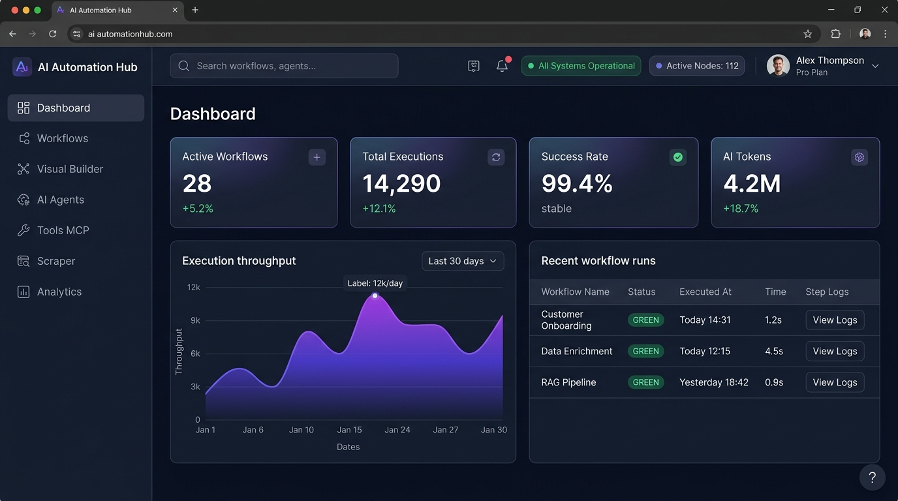
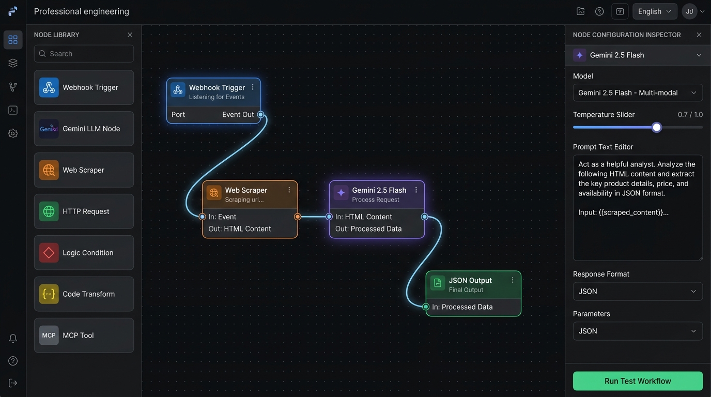
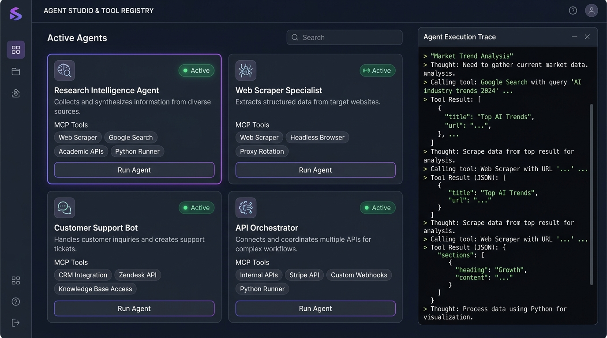

# ⚡ AI Automation & Agent Hub

> **Production-grade internal AI workflow automation platform, visual node pipeline builder, autonomous AI agent fleet, Model Context Protocol (MCP) tool registry, web scraper, and execution engine.**

**Tech Stack**: React 19 • TypeScript • Tailwind CSS • Express • Google GenAI • Vite

---

## 📸 Screenshots Showcase

### 1. Executive Telemetry & Automation Dashboard
Monitor active workflows, total system executions, success rates, live execution feeds, and AI token consumption at a glance.



---

### 2. Drag-and-Drop Visual Workflow Builder
Compose intelligent pipelines by connecting triggers, Google Gemini LLM reasoning, server-side web scrapers, HTTP endpoints, JavaScript code transformations, and MCP tools with interactive bezier connections.



---

### 3. Autonomous AI Agents & MCP Tool Hub
Deploy specialized AI agents with tailored roles, backstories, system prompts, memory, and direct access to registered Model Context Protocol (MCP) tools.



---

## 🌟 Key Features

### 🎛️ 1. Real-Time Executive Dashboard
- **Live KPI Telemetry**: Instant overview of Active Workflows, Total Runs, Global Success Rate (%), and Cumulative AI Tokens.
- **Throughput Visualizer**: Interactive execution volume and latency trend graphs.
- **Real-Time Activity Stream**: Live feed of recent pipeline runs with status badges (Success, Running, Failed, Queued), durations, and triggers.
- **Fast-Action Launchpad**: One-click quick creation for visual workflows, agent task delegations, scraping tasks, and API tests.

---

### 🧩 2. Visual Node-Based Workflow Automation Canvas
- **Infinite Drag-and-Drop Canvas**: Pan, zoom, grid snapping, and interactive bezier connection lines.
- **Extensible Node Ecosystem**:
  - **Webhook & Scheduled Trigger**: Ingest external HTTP webhooks or configure cron-based automated execution schedules.
  - **Google Gemini LLM Node**: Leverage `gemini-2.5-flash` or `gemini-1.5-pro` with dynamic template interpolation (`{{input.url}}`, `{{step1.output}}`), temperature tuning, and system instructions.
  - **Web Scraper Node**: Server-side DOM parsing via Cheerio, CSS selector targeting, HTML-to-clean-Markdown extraction, and link collection.
  - **HTTP / REST Request Node**: Execute authenticated requests (GET, POST, PUT, DELETE, PATCH) with custom headers, query params, and JSON payloads.
  - **Conditional Logic Branching**: Execute JavaScript conditional expressions (`{{step1.status}} === 200`) to branch execution paths dynamically.
  - **Code Transform Node**: Sandboxed JavaScript execution environment for transforming data payloads, mapping arrays, and reshaping schemas.
  - **MCP Tool Invoker Node**: Execute registered Model Context Protocol tools directly within visual pipelines.
  - **Structured Output Node**: Format output payloads into clean JSON, push webhooks, or trigger status notifications.
- **Interactive Dry-Run & Step-by-Step Tracer**: Run test executions directly within the builder with live animated node status, execution timers, input/output inspection drawers, and step logs.
- **Workflow Lifecycle**: Duplicate, activate, pause, export, and import workflow schemas.

---

### 🤖 3. Autonomous AI Agents Hub
- **Specialized Agent Fleet**: Define autonomous agents tailored for specific operational domains:
  - *Research Intelligence Agent*: Deep web synthesis and structured data extraction.
  - *Web Scraping Specialist*: Automated data harvesting, table parsing, and selector generation.
  - *API & DevOps Orchestrator*: Endpoint health checks, webhook triage, and alert routing.
- **Configurable Personas**: Granular control over Agent Name, Role, Goal, Backstory, and System Prompts.
- **Tool Assignment**: Link agents to any registered MCP tool (Google Search, Web Scraper, Code Runner, Calculator, HTTP Fetch).
- **Interactive Agent Console**: Delegate tasks, review agent reasoning steps, view tool calls, and inspect structured outputs.

---

### 🛠️ 4. Model Context Protocol (MCP) Tool Registry
- **Universal Tool Standard**: Standardized tool interface compatible with modern AI agent workflows.
- **Pre-Built Internal Tools**:
  - `web_scraper`: Extracts article text, markdown, and metadata from any public URL.
  - `code_runner`: Sandboxed code execution for math, data parsing, and string formatting.
  - `http_fetch`: Makes secure server-side HTTP calls to external APIs.
  - `weather_lookup`: Real-time weather and forecast retrieval.
  - `calculator`: Precision numerical calculation engine.
  - `db_query`: Query structured internal records and datasets.
- **Custom Tool Creator**: Build new MCP tools directly in the UI with JSON Schema input parameter specifications and custom execution handlers.
- **In-App Tool Playground**: Test inputs and validate outputs interactively before deploying tools to agents.

---

### 🕷️ 5. Integrated High-Performance Web Scraper Studio
- **DOM & Content Extraction**: Scrape clean text, HTML, and converted Markdown from any accessible website.
- **CSS Selector Fine-Tuning**: Target specific elements (e.g., `article`, `.post-body`, `h1, h2, p`, `table`).
- **Live Preview Studio**: View parsed Markdown and raw JSON results side-by-side.
- **1-Click AI Integration**: Send scraped data straight to Google Gemini for summarization, entity extraction, or translation.

---

### 🧪 6. Gemini LLM Playground & Prompt Lab
- **Prompt Engineering Sandbox**: Test prompts against Gemini models without affecting production workflows.
- **Hyperparameter Controls**: Fine-tune Temperature, Top-P, Top-K, and Max Output Tokens.
- **Live Metrics**: Real-time response generation latency, prompt token count, and candidate token measurement.
- **Multi-Turn Chat Testing**: Simulate conversation flows and system instructions.

---

### ⚡ 7. API Tester & REST Client
- **Built-in Postman Alternative**: Test automation endpoints and third-party APIs directly from the browser.
- **Header & Payload Management**: Configure Bearer tokens, API keys, Content-Type, and request JSON bodies.
- **Comprehensive Response Viewer**: Formatted JSON viewer, response time profiling, status badges, and response headers inspection.

---

### 📜 8. Executions Audit & Observability Center
- **Complete Run History**: Audit trail of every automated execution across all workflows and agents.
- **Deep Step-by-Step Inspection**: Review input payloads, output data, error messages, and duration for every individual node in an execution path.
- **One-Click Retry**: Re-run failed workflows with the exact initial input payload.
- **Filter & Search**: Query execution logs by workflow ID, status (`success`, `failed`, `running`), or date range.

---

### 📊 9. Analytics & Usage Telemetry
- **Volume & Success Metrics**: 7-day and 30-day execution metrics, failure rates, and system uptime.
- **Token Expenditure Breakdown**: Token consumption analytics categorized by model (`gemini-2.5-flash` vs. `gemini-1.5-pro`).
- **Node Usage Heatmap**: Identify which node types (LLM, Scraper, HTTP, Code) are most utilized across your automations.

---

## 🏗️ Architecture & Directory Structure

```
ai-automation-agent-hub/
├── backend/                   # Standalone backend service & models
│   ├── config.py
│   ├── main.py
│   ├── models.py
│   └── requirements.txt
├── docs/                      # Documentation assets & screenshots
│   └── screenshots/
│       ├── dashboard.jpg
│       ├── workflow_builder.jpg
│       └── agents_hub.jpg
├── public/                    # Static assets & screenshots
│   └── screenshots/
├── src/                       # Frontend application (React 19 + TypeScript)
│   ├── components/            # Reusable UI components (Navbar, Sidebar, Modals, Toast)
│   ├── pages/                 # Feature views
│   │   ├── DashboardPage.tsx
│   │   ├── WorkflowsListPage.tsx
│   │   ├── WorkflowBuilderPage.tsx
│   │   ├── AgentsPage.tsx
│   │   ├── ToolsMcpPage.tsx
│   │   ├── WebScraperPage.tsx
│   │   ├── PlaygroundPage.tsx
│   │   ├── ApiTesterPage.tsx
│   │   ├── ExecutionsPage.tsx
│   │   ├── AnalyticsPage.tsx
│   │   └── SettingsPage.tsx
│   ├── services/              # API clients & backend communication
│   ├── types/                 # Shared TypeScript interfaces
│   ├── App.tsx                # Master routing and global state
│   └── index.css              # Tailwind CSS styles
├── server.ts                  # Full-stack Node.js / Express backend with Vite middleware
├── package.json
└── tsconfig.json
```

### Technology Highlights
- **Frontend**: React 19, TypeScript, Tailwind CSS v4, Motion, Lucide Icons.
- **Backend & Execution Engine**: Node.js, Express, TypeScript, `@google/genai` (Google GenAI SDK), Cheerio (server-side web scraping).
- **Bundler & Dev Server**: Vite 8 with integrated Express middleware.

---

## 🚀 Getting Started

### Prerequisites
- **Node.js**: v18.0.0 or higher
- **npm** or **bun**
- **Gemini API Key**: An active API key with access to Gemini models.

---

### 1. Installation

Clone or extract the repository, then install dependencies:

```bash
npm install
```

---

### 2. Environment Configuration

Create a `.env` file in the project root based on `.env.example`:

```bash
cp .env.example .env
```

Set your environment variables:

```env
# Gemini API Key
GEMINI_API_KEY=your_gemini_api_key_here

# Port Configuration
PORT=3000
```

---

### 3. Running the Development Server

Start the full-stack server (Express backend + Vite frontend):

```bash
npm run dev
```

The application will be available at: `http://localhost:3000`

---

### 4. Production Build

To compile TypeScript and bundle the frontend for production:

```bash
npm run build
npm start
```

---

## 🔌 API Endpoints Reference

| Method | Endpoint | Description |
|---|---|---|
| `GET` | `/api/workflows` | List all automation workflows |
| `POST` | `/api/workflows` | Create a new workflow |
| `PUT` | `/api/workflows/:id` | Update an existing workflow |
| `DELETE` | `/api/workflows/:id` | Delete a workflow |
| `POST` | `/api/workflows/:id/execute` | Trigger a workflow execution |
| `GET` | `/api/executions` | Retrieve execution history and trace logs |
| `GET` | `/api/executions/:id` | Get detailed node-by-node execution logs |
| `GET` | `/api/agents` | List all configured AI agents |
| `POST` | `/api/agents/:id/run` | Execute an autonomous agent task |
| `GET` | `/api/tools` | List registered MCP tools |
| `POST` | `/api/tools/execute` | Test or invoke an MCP tool |
| `POST` | `/api/scraper/extract` | Scrape and extract text/markdown from a URL |
| `POST` | `/api/ai/generate` | Generate text using Gemini LLM models |
| `GET` | `/api/analytics` | Fetch throughput, token usage, and system health metrics |

---

## 🔒 Security & Best Practices
- **API Keys**: All LLM calls and web scraping requests are handled server-side through `server.ts` to protect API keys from client exposure.
- **Execution Sandboxing**: JavaScript code transform nodes evaluate within bounded scopes to safeguard system stability.
- **Trace Auditing**: Every payload, intermediate step, and response is recorded in the execution log for full observability.

---

## 📄 License
This project is open-source and distributed under the MIT License.
